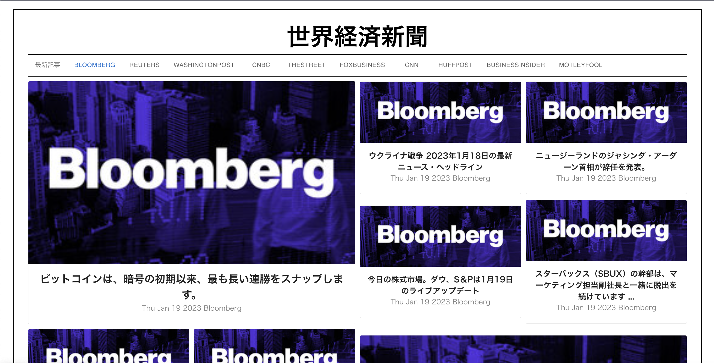

# ニュースアプリ

Webアプリケーションで、ReactとFirebaseで実装。

[Google News API](https://news.google.com/rss/)から情報を取得する。自動取得にはPythonを用いて行う。詳細は、[GetNews](https://github.com/Babmuclr/GetNews)を参照。

メイン画面は、次のようになっている。

各記事の画像・タイトル・投稿日・リソースを表示。タイトルを翻訳することで、簡単に読めるようにする。記事をクリックすると、記事の元のURLへ遷移する。

個別の媒体ごとにフィルタリングすることもできる。

